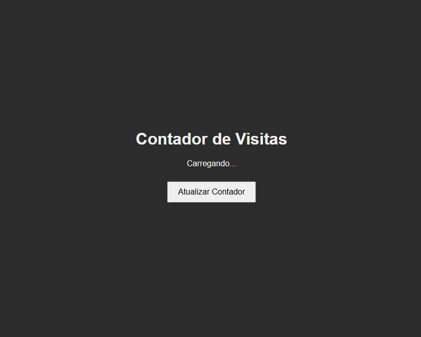

# 📊 Contador de Visitantes com Docker

Este projeto é uma aplicação simples para **contar o número de visitantes de uma página**, mas o foco principal foi **containerizar a aplicação** utilizando **Docker** e **Docker Compose**. Cada parte do sistema foi colocada em um container, incluindo o frontend, backend e banco de dados (Redis).

Além disso, o projeto foi uma ótima oportunidade para **treinar o uso de GitHub Actions** para automação de CI/CD e **realizar testes com Jest** no backend.

---

## 📸 Pré-visualização

  

---

## 🛠️ Tecnologias Utilizadas

- **Frontend**: HTML, CSS, JavaScript
- **Backend**: Node.js
- **Banco de Dados**: Redis
- **Docker**: Containerização com Docker e Docker Compose
- **CI/CD**: Automação com GitHub Actions
- **Testes**: Jest

---

## 🔍 Funcionalidades

- Conta e exibe o número de visitantes únicos.
- Utiliza o Redis como banco de dados para armazenar os dados de contagem.
- Infraestrutura totalmente containerizada:
  - **Frontend** em um container.
  - **Backend** em um container.
  - **Redis** em um container.
- Testes automatizados com Jest para garantir o funcionamento correto da aplicação.
- Pipeline de CI/CD configurado com GitHub Actions.

---

📚 *Projeto desenvolvido para praticar Docker, CI/CD e testes automatizados, além de consolidar conceitos de desenvolvimento fullstack.*
